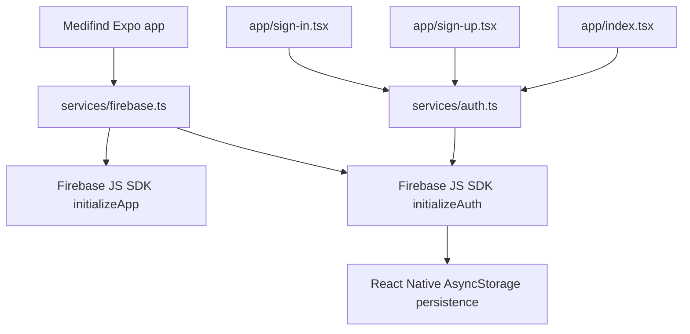
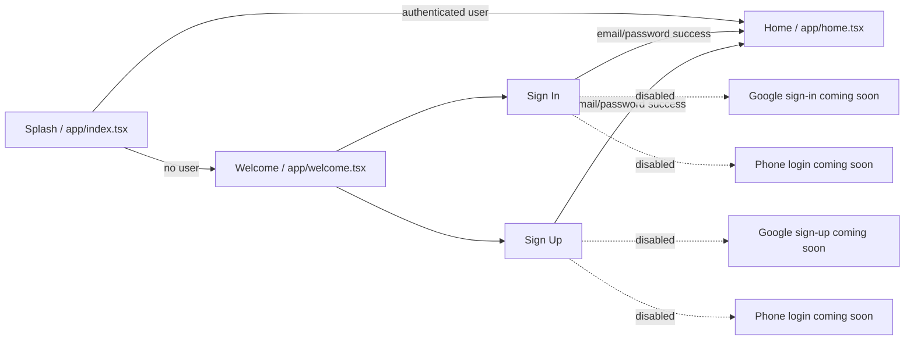

# Medifind Mobile Auth Verification Report - 2026-04-25

## Scope

This report reviews the Medifind mobile work completed on 2026-04-25, focused on the Expo scaffold, authentication screens, Firebase Auth SDK selection, and navigation behavior.

The current app is an Expo managed TypeScript app under `apps/mobile/` using `expo-router` and the Firebase JS SDK. No backend Functions, Firestore reads/writes, Storage calls, or Data Connect calls are made by the mobile app code yet.

## Work Completed Today

- Fixed the mobile Firebase Auth SDK mismatch by removing React Native Firebase usage from the mobile app.
- Removed `@react-native-firebase/auth`, `expo-auth-session`, and `expo-web-browser` from mobile dependencies.
- Reworked `apps/mobile/services/firebase.ts` to initialize Firebase with the Firebase JS SDK only.
- Added React Native Auth persistence through `@react-native-async-storage/async-storage`.
- Added required Expo public Firebase env var checks with clear development errors for missing config.
- Reworked `apps/mobile/services/auth.ts` around Firebase JS SDK email/password methods.
- Added a basic Splash auth gate using `onAuthStateChanged`.
- Kept Google and Phone buttons disabled and visibly marked as coming soon.
- Confirmed Sign In and Sign Up screens use the shared `Screen`, `ActionButton`, and design tokens.
- Updated handoff docs and Graphify outputs.
- Committed and pushed the SDK cleanup as:
  - `025b383 fix(mobile): use Firebase JS SDK consistently for auth`

## Current Auth Architecture



## Navigation Flow



## Verification Results

| Area | Result | Notes |
| --- | --- | --- |
| TypeScript | Passed | `npm run typecheck` completed with no errors. |
| Native bundle smoke test | Passed | `npx expo export --platform android --output-dir .expo\verification-export` completed and bundled `expo-router/entry`. |
| Firebase SDK choice | Passed | `npm ls firebase @react-native-firebase/auth @react-native-firebase/app --depth=0` reports only `firebase@12.12.1`. |
| React Native persistence dependency | Passed | `npm ls expo-auth-session expo-web-browser @react-native-async-storage/async-storage --depth=0` reports only `@react-native-async-storage/async-storage@3.0.2`. |
| Mobile Firebase env presence | Passed | Required `EXPO_PUBLIC_FIREBASE_*` keys are present in untracked `apps/mobile/.env`; values were not printed. |
| Firestore / Functions / Storage calls | Passed | App code has no Firestore, Functions, Storage, Database, fetch, or axios calls. |
| Splash auth gate | Code verified | Uses `subscribeToAuthState`; routes to `/home` if a user exists and `/welcome` otherwise. |
| Sign In UI | Code verified | Uses designed layout, loading state, friendly validation errors, and email/password Firebase Auth. |
| Sign Up UI | Code verified | Uses designed layout, terms checkbox, loading state, friendly validation errors, and email/password Firebase Auth. |
| Email/password Firebase Auth | Code verified | Uses `signInWithEmailAndPassword` and `createUserWithEmailAndPassword`. Full credentialed live test needs a Firebase test account. |
| Google login | Not implemented | Current committed state intentionally disables Google buttons. Missing `EXPO_PUBLIC_GOOGLE_ANDROID_CLIENT_ID` and explicit reimplementation approval are blockers. |
| Phone OTP | Stubbed | UI is disabled and marked "Phone login coming soon"; no OTP logic exists yet. |

## Commands Run

```powershell
cd C:\projects\nearnest\web-portal\apps\mobile
npm run typecheck
npm ls firebase @react-native-firebase/auth @react-native-firebase/app --depth=0
npm ls expo-auth-session expo-web-browser @react-native-async-storage/async-storage --depth=0
npx expo export --platform android --output-dir .expo\verification-export
```

Additional static checks were run from the repo root:

```powershell
rg -n "@react-native-firebase|expo-auth-session|expo-web-browser|GoogleAuthProvider|signInWithCredential|firebase/analytics|getAnalytics|firebase/auth/compat|firebase/compat" apps\mobile\package.json apps\mobile\app.json apps\mobile\services apps\mobile\app apps\mobile\components apps\mobile\theme
rg -n "firebase/firestore|firebase/functions|firebase/storage|firebase/database|getFirestore|getFunctions|getStorage|getDatabase|httpsCallable|collection\(|doc\(|getDoc\(|getDocs\(|setDoc\(|addDoc\(|updateDoc\(|deleteDoc\(|query\(|where\(|onSnapshot\(|fetch\(|axios" apps\mobile\app apps\mobile\services apps\mobile\components apps\mobile\theme
```

## Issues And Blockers

1. **Google login is not currently working because it is not implemented.**
   The current code intentionally disables Google buttons after the SDK mismatch cleanup. To make Google login work, the team needs to explicitly approve reintroducing the Expo-compatible Google flow and provide the missing Android OAuth client ID through untracked local env.

2. **No interactive device credential test was performed in this session.**
   Automated checks confirm the email/password code path and native bundle. A full live auth test still needs a known Firebase test account or manual device interaction.

3. **Forgot Password is visible as text only.**
   The Sign In screen shows "Forgot password?" but it is not wired to a route or Firebase reset API yet.

4. **Profile setup gate is not implemented yet.**
   Sign-up success currently routes directly to `/home`. Product docs still expect a profile-completion gate before release.

5. **Generated Expo export output is local-only.**
   `.expo/verification-export` was produced for smoke testing and should remain uncommitted.

## Confirmed Non-Goals / Not Present

- No backend Functions calls.
- No Firestore reads or writes.
- No Storage calls.
- No Data Connect usage.
- No Google OAuth runtime code.
- No Phone OTP runtime code.
- No cart, checkout, payment, delivery, order tracking, or prescription upload flow.

## Recommended Next Steps

1. Decide whether Google login should be reintroduced now or remain deferred until the development-build OAuth setup is complete.
2. If Google auth is approved, add `EXPO_PUBLIC_GOOGLE_ANDROID_CLIENT_ID` locally and implement the Expo Auth Session flow using Firebase JS SDK credentials only.
3. Add Forgot Password using `sendPasswordResetEmail`.
4. Add Email Verification using `sendEmailVerification` and an email-verification route.
5. Add a profile-completion gate before Home, but only after the Firestore profile contract and rules are approved.
6. Run a manual device test with a known Firebase test account:
   - Fresh install -> Splash -> Welcome.
   - Welcome -> Sign In.
   - Invalid email/password -> friendly error.
   - Valid email/password -> Home.
   - App restart with persisted session -> Splash -> Home.
   - Sign Up with a disposable test email -> Home or future Profile Setup gate.

## Verification Checklist

- [x] Expo mobile app compiles with TypeScript.
- [x] Android native export bundles successfully.
- [x] Firebase JS SDK is the only Firebase Auth SDK used by mobile.
- [x] React Native Firebase packages are not installed.
- [x] Analytics is not initialized in React Native.
- [x] Required Firebase Expo public env keys are present locally.
- [x] Sign In screen calls Firebase email/password auth.
- [x] Sign Up screen calls Firebase email/password auth.
- [x] Splash listens for Firebase Auth state and routes accordingly.
- [x] Google buttons are disabled and marked coming soon.
- [x] Phone buttons are disabled and marked coming soon.
- [x] No Firestore/Functions/Storage/backend calls exist in mobile app code.
- [ ] Live email/password login with a real Firebase test account.
- [ ] Google login.
- [ ] Forgot Password route/API.
- [ ] Email Verification route/API.
- [ ] Profile setup completion gate.
